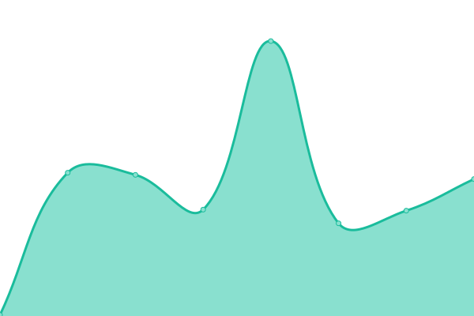
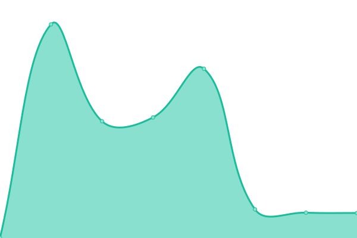
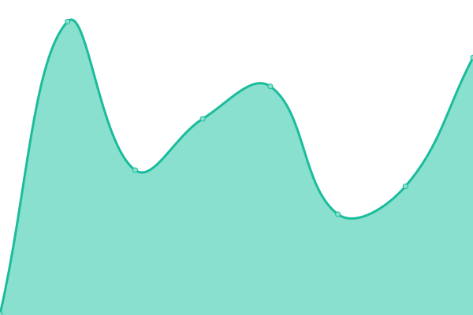

# [📈 Live Status](https://upptime.fureweb.com): <!--live status--> **🟧 Partial outage**

This repository contains the open-source uptime monitor and status page for [Jihwan Oh](https://fureweb-com.github.io), powered by [Upptime](https://github.com/upptime/upptime).

With [Upptime](https://upptime.js.org), you can get your own unlimited and free uptime monitor and status page, powered entirely by a GitHub repository. We use [Issues](https://github.com/fureweb-com/upptime.fureweb.com/issues) as incident reports, [Actions](https://github.com/fureweb-com/upptime.fureweb.com/actions) as uptime monitors, and [Pages](https://upptime.fureweb.com) for the status page.

<!--start: status pages-->
<!-- This summary is generated by Upptime (https://github.com/upptime/upptime) -->
<!-- Do not edit this manually, your changes will be overwritten -->
<!-- prettier-ignore -->
| URL | Status | History | Response Time | Uptime |
| --- | ------ | ------- | ------------- | ------ |
|  [fureweb blog (GITHUB)](https://fureweb-com.github.io) | 🟩 Up | [fureweb-blog-github.yml](https://github.com/fureweb-com/upptime.fureweb.com/commits/HEAD/history/fureweb-blog-github.yml) | 

 94ms
     
 | 

<a href="https://upptime.fureweb.com/history/fureweb-blog-github">100.00%</a>
    

|  [api.fureweb.com](https://api.fureweb.com) | 🟩 Up | [api-fureweb-com.yml](https://github.com/fureweb-com/upptime.fureweb.com/commits/HEAD/history/api-fureweb-com.yml) | 

 657ms
     
 | 

<a href="https://upptime.fureweb.com/history/api-fureweb-com">100.00%</a>
    

|  [wiki.fureweb.com](https://wiki.fureweb.com) | 🟩 Up | [wiki-fureweb-com.yml](https://github.com/fureweb-com/upptime.fureweb.com/commits/HEAD/history/wiki-fureweb-com.yml) | 

 889ms
     
 | 

<a href="https://upptime.fureweb.com/history/wiki-fureweb-com">100.00%</a>
    

|  [addugo](https://addugo.com) | 🟥 Down | [addugo.yml](https://github.com/fureweb-com/upptime.fureweb.com/commits/HEAD/history/addugo.yml) | 

 0ms
     
 | 

<a href="https://upptime.fureweb.com/history/addugo">0.00%</a>
    

|  [fureweb blog (legacy)](http://fureweb.com) | 🟩 Up | [fureweb-blog-legacy.yml](https://github.com/fureweb-com/upptime.fureweb.com/commits/HEAD/history/fureweb-blog-legacy.yml) | 

 780ms
     
 | 

<a href="https://upptime.fureweb.com/history/fureweb-blog-legacy">100.00%</a>
    

|  [webpoll (legacy)](http://webpoll.co.kr) | 🟩 Up | [webpoll-legacy.yml](https://github.com/fureweb-com/upptime.fureweb.com/commits/HEAD/history/webpoll-legacy.yml) | 

 1131ms
     
 | 

<a href="https://upptime.fureweb.com/history/webpoll-legacy">100.00%</a>
    

|  [Y FLUX PMS (PC)](https://pms.yflux.biz) | 🟩 Up | [y-flux-pms-pc.yml](https://github.com/fureweb-com/upptime.fureweb.com/commits/HEAD/history/y-flux-pms-pc.yml) | 

 1107ms
     
 | 

<a href="https://upptime.fureweb.com/history/y-flux-pms-pc">100.00%</a>
    

|  [goree](https://goree.kr) | 🟩 Up | [goree.yml](https://github.com/fureweb-com/upptime.fureweb.com/commits/HEAD/history/goree.yml) | 

 1964ms
     
 | 

<a href="https://upptime.fureweb.com/history/goree">100.00%</a>
    

|  [npm](https://status.npmjs.org) | 🟩 Up | [npm.yml](https://github.com/fureweb-com/upptime.fureweb.com/commits/HEAD/history/npm.yml) | 

 212ms
     
 | 

<a href="https://upptime.fureweb.com/history/npm">100.00%</a>
    

<!--end: status pages-->

[**Visit our status website →**](https://upptime.fureweb.com)

## 📄 License

- Powered by: [Upptime](https://github.com/upptime/upptime)
- Code: [MIT](./LICENSE) © [Jihwan Oh](https://fureweb-com.github.io)
- Data in the `./history` directory: [Open Database License](https://opendatacommons.org/licenses/odbl/1-0/)
